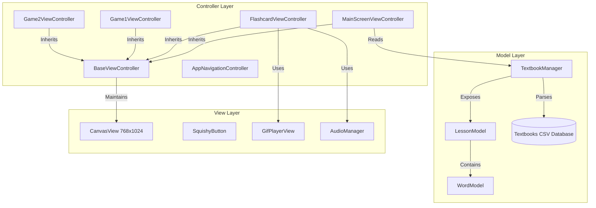

# Kids Chinese Learning App - Technical Architecture & Documentation

This application is a native iPad replica of a children's Chinese learning app, built from scratch using **Objective-C** and targeting **iOS 9.0 (armv7 32-bit)**. It is specifically optimized to run efficiently on legacy hardware like the **iPad Mini 1st Generation** (A5 chip, 512MB RAM) under strict memory limitations (< 80MB footprint).

---

## 1. Architectural Pattern (MVC)

The application adheres to the classic **Model-View-Controller (MVC)** architecture. Because it uses pure UIKit without Storyboards or Nib/XIB files, all views and layouts are constructed programmatically for predictability, compilation speed, and memory control.



### Presentation & Navigation Layer
*   **[BaseViewController](file:///Users/macmini/Downloads/kids_chinese_ui/src/Controllers/BaseViewController.m)**: The root class of all views. Manages the layout scaling canvas, handles system color palettes, and monitors runtime RAM usage.
*   **[AppNavigationController](file:///Users/macmini/Downloads/kids_chinese_ui/src/Core/AppNavigationController.m)**: A custom navigation controller that locks rotation to portrait mode, preventing orientation state changes from consuming layout cycles.

### Model & Data Layer
*   **[TextbookManager](file:///Users/macmini/Downloads/kids_chinese_ui/src/Models/TextbookManager.m)**: A thread-safe singleton that parses the textbook data from CSV files and builds in-memory indexes of books, lessons, and vocabulary words.
*   **[WordModel](file:///Users/macmini/Downloads/kids_chinese_ui/src/Models/WordModel.m)**: Represents a single Chinese character, its Pinyin representation (with/without tones), and resolves the filenames of its associated voice pronunciations and stroke animation GIFs.

---

## 2. Core Layout Engine: Fixed-Resolution Canvas

To support modern UI layout rules on legacy iOS versions without Auto Layout overhead, the app uses a **Viewport Scaling Canvas** approach:

1.  Each View Controller lays out its subviews programmatically on a static canvas view (`self.canvasView`) measured at exactly **768.0f x 1024.0f** points (iPad Mini 1 Portrait resolution).
2.  At layout time (`viewWillLayoutSubviews`), `BaseViewController` queries the physical screen dimensions of the host view and computes a scale ratio:
    $$Scale = \min\left(\frac{Width_{Screen}}{768.0}, \frac{Height_{Screen}}{1024.0}\right)$$
3.  A simple 2D affine transform is applied to the canvas:
    ```objc
    self.canvasView.transform = CGAffineTransformMakeScale(scale, scale);
    self.canvasView.center = CGPointMake(bounds.size.width / 2.0f, bounds.size.height / 2.0f);
    ```
4.  This scales, centers, and letterboxes/pillarboxes the UI automatically on any device aspect ratio (such as standard iPads, iPad Pro, or iPhone emulator screens) with zero autolayout performance costs.

---

## 3. Memory Optimization & OOM Mitigation (< 80MB Target)

The iPad Mini 1 is equipped with only **512MB of physical RAM**, meaning the iOS JetSam memory daemon will kill apps that exceed a fraction of this memory. To guarantee stability:

*   **Dynamic GIF Decoding ([GifPlayerView](file:///Users/macmini/Downloads/kids_chinese_ui/src/Core/GifPlayerView.m))**:
    Instead of decoding all frames of a stroke-order GIF and caching them as an `animatedImageWithImages:` array (which consumes ~10-15MB RAM per GIF), `GifPlayerView` uses `CGImageSourceCreateImageAtIndex` on a `CADisplayLink` tick. It decodes *only* the current visible frame to a CGImage, binds it to the backing CALayer, and immediately calls `CGImageRelease` to clean up the frame's bitmap buffer.
*   **Auto-Deallocating Audio Player ([AudioManager](file:///Users/macmini/Downloads/kids_chinese_ui/src/Core/AudioManager.m))**:
    Reclaims audio memory by monitoring playback termination. When an MP3 sound finishes playing, the `AVAudioPlayer` instance is immediately deallocated rather than cached.
*   **Diagnostic Memory Logs**:
    `BaseViewController` queries the Mach task API to monitor the active RAM allocation:
    ```objc
    struct mach_task_basic_info info;
    task_info(mach_task_self(), MACH_TASK_BASIC_INFO, (task_info_t)&info, &size);
    ```
    Resident memory sizes are logged to the console during key lifecycle events and whenever the system triggers memory warnings.

---

## 4. Custom Clang Toolchain Pipeline

Because Xcode 13's GUI and build tools crash on modern macOS versions (Sonoma/Sequoia) due to `CoreDevice` linking incompatibilities, the app compiles via a custom build script ([compile.py](file:///Users/macmini/Downloads/kids_chinese_ui/compile.py)):

1.  **Compilation**: Iterates through all `.m` files and compiles them using the legacy Xcode 13 compiler toolchain, targeting `armv7-apple-ios9.0` with standard Automatic Reference Counting (ARC) flags:
    ```bash
    clang -x objective-c -target armv7-apple-ios9.0 -isysroot [iPhoneOS.sdk] -fobjc-arc -c [source.m] -o [object.o]
    ```
2.  **Linking**: Combines the object files, linking them against essential native iOS frameworks:
    *   `UIKit` (UI framework)
    *   `Foundation` (Core NSObject and runtime libraries)
    *   `AVFoundation` (Audio recording and playback)
    *   `ImageIO` (Raw image decoding)
    *   `QuartzCore` (Display link rendering)
    *   `CoreGraphics` (Affine transformations and drawing)
3.  **Packaging**: Packs the compiled binary, `Info.plist`, CSV databases, and audios/GIFs into a standard app bundle structure inside a zipped `Payload/` folder, outputting a Sideloadly-ready **`ChineseApp.ipa`**.
